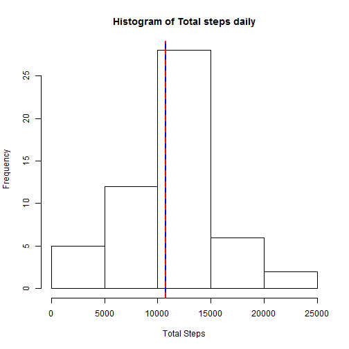
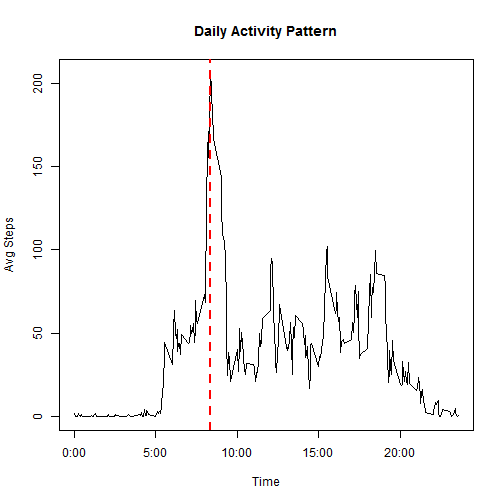
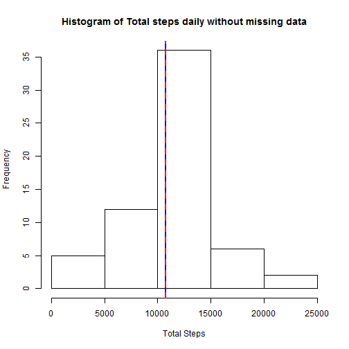

# Reproducible Research: Peer Assessment 1


## Loading and preprocessing the data


```r
unzip("activity.zip")
data      <- read.csv("activity.csv")
data$date <- as.Date(data$date,"%Y-%m-%d")
```

## What is mean total number of steps taken per day?

```r
dailySteps <-  aggregate( steps ~  date, data[!is.na(data$steps),], sum) 

# Calculate the mean and Median
meanStep       <- mean(dailySteps$steps)
medianStep    <- median(dailySteps$steps)

hist(dailySteps$steps,xlab ="Total Steps", main = "Histogram of Total steps daily")

abline(v = meanStep, col = "blue", lwd = 2)
abline(v = medianStep, col = "red", lwd =2 ,lty =2)
```

 
## What is the average daily activity pattern? 


```r
avgSteps <-  aggregate( steps ~  interval, data[!is.na(data$steps),], FUN=mean)

plot(x = avgSteps$interval, y= avgSteps$steps,type="l",xaxt = 'n', xlab="Time", ylab="Avg Steps",main="Daily Activity Pattern")

maxStepsTime <- avgSteps[avgSteps$steps == max(avgSteps$steps),]$interval
abline(v = maxStepsTime, col = "red", lwd =2 ,lty =2)

axis(1, labels = c('0:00', '5:00', '10:00', '15:00', '20:00'), at = c(0, 500, 1000, 1500, 2000))
```

 
### maximum number of steps ocuurs at

```r
maxStepsTime
```

```
## [1] 835
```
## Imputing missing values

### Total Number of missing values

```r
table(is.na(data$steps))
```

```
## 
## FALSE  TRUE 
## 15264  2304
```

### Fill Missing Data
- we will use the previous avg steps daily to fill missing data
- avgSteps data has the avg steps of each interval 
- Then match the interval of avg steps daily data and the interval of missing data.

```r
completeData <- data
completeData[is.na(completeData$steps),]$steps <- avgSteps[match(avgSteps$interval,completeData[is.na(completeData$steps),]$interval),]$steps

#test missing data
completeData[is.na(completeData$steps),]
```

```
## [1] steps    date     interval
## <0 rows> (or 0-length row.names)
```
### histogram of complete data


```r
dailySteps2     <- aggregate( steps ~  date, completeData, sum)
meanStep2       <- mean(dailySteps2$steps)
medianStep2     <- median(dailySteps2$steps)

hist(dailySteps2$steps,xlab ="Total Steps", main = "Histogram of Total steps daily without missing data")

abline(v = meanStep2, col = "blue", lwd = 2)
abline(v = medianStep2, col = "red", lwd =2 ,lty =2)
```

 
### Differance between missing dataset and estimated dataset

```r
summary(data)
```

```
##      steps            date               interval   
##  Min.   :  0.0   Min.   :2012-10-01   Min.   :   0  
##  1st Qu.:  0.0   1st Qu.:2012-10-16   1st Qu.: 589  
##  Median :  0.0   Median :2012-10-31   Median :1178  
##  Mean   : 37.4   Mean   :2012-10-31   Mean   :1178  
##  3rd Qu.: 12.0   3rd Qu.:2012-11-15   3rd Qu.:1766  
##  Max.   :806.0   Max.   :2012-11-30   Max.   :2355  
##  NA's   :2304
```

```r
summary(completeData)
```

```
##      steps            date               interval   
##  Min.   :  0.0   Min.   :2012-10-01   Min.   :   0  
##  1st Qu.:  0.0   1st Qu.:2012-10-16   1st Qu.: 589  
##  Median :  0.0   Median :2012-10-31   Median :1178  
##  Mean   : 37.4   Mean   :2012-10-31   Mean   :1178  
##  3rd Qu.: 27.0   3rd Qu.:2012-11-15   3rd Qu.:1766  
##  Max.   :806.0   Max.   :2012-11-30   Max.   :2355
```
## Are there differences in activity patterns between weekdays and weekends?


```r
completeData$daytype <- ifelse( weekdays(completeData$date) %in% c('Saturday','Sunday'),"weekend","weekday")
completeData$daytype <- as.factor(completeData$daytype)

summaryData <- aggregate( steps ~  interval+daytype, completeData, FUN=mean)
library(ggplot2)
```

```
## Warning: package 'ggplot2' was built under R version 3.1.1
```

```r
ggplot(summaryData,aes(x = interval, y = steps)) +geom_line()  + facet_grid(daytype ~ .)
```

 


